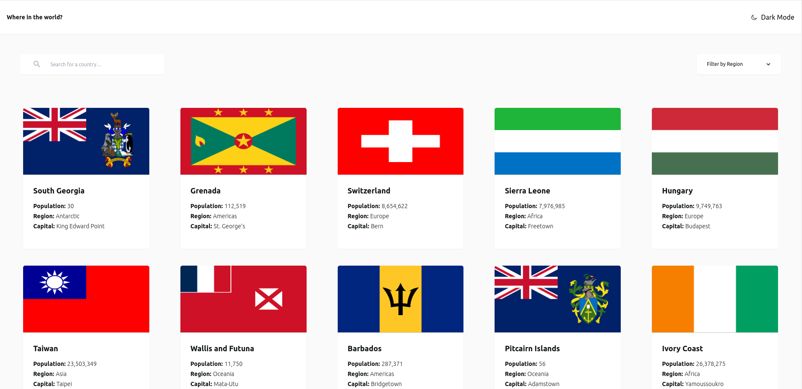

# Frontend Mentor - REST Countries API with Color Theme Switcher

This is a solution to the [REST Countries API with color theme switcher challenge on Frontend Mentor](https://www.frontendmentor.io/challenges/rest-countries-api-with-color-theme-switcher-5cacc469fec04111f7b848ca). Frontend Mentor challenges help you improve your coding skills by building realistic projects.

## Table of Contents

- [Overview](#overview)
  - [The Challenge](#the-challenge)
  - [Screenshot](#screenshot)
  - [Links](#links)
- [My Process](#my-process)
  - [Built With](#built-with)
  - [What I Learned](#what-i-learned)
  - [Continued Development](#continued-development)
  - [Useful Resources](#useful-resources)
- [Author](#author)

## Overview

### The Challenge

Users should be able to:

- See all countries from the API on the homepage
- Search for a country using an `input` field
- Filter countries by region
- Click on a country to see more detailed information on a separate page
- Click through to the border countries on the detail page
- Toggle the color scheme between light and dark mode *(optional)*

### Screenshot

### Links

- Solution URL: [GitHub Repository](https://github.com/TedJenkler/REST-Countries-API-with-color-theme-switcher-v2)
- Live Site URL: [Live Demo](https://tedjenkler.github.io/REST-Countries-API-with-color-theme-switcher-v2/)

## My Process

### Built With

- **Vite**: A fast build tool and development server that provides an efficient development experience with rapid hot module replacement and optimized builds.
- **React**: A JavaScript library for building user interfaces, enabling component-based architecture and efficient rendering.
- **React Router v6**: A library for managing navigation and routing in React applications, helping to handle routes and render components based on URL paths.
- **Tailwind CSS**: A utility-first CSS framework that provides low-level utility classes to build custom designs quickly and consistently.
- **Redux Toolkit**: A library for managing application state with Redux, offering a streamlined approach to state management and reducing boilerplate code.
- **Axios**: A promise-based HTTP client for making requests to external APIs, providing a simple and intuitive API for handling network requests.
- **CSS Grid**: A powerful layout system in CSS for creating complex, responsive grid-based designs.
- **Flexbox**: A layout model in CSS that allows for the creation of flexible and responsive layouts with ease.
- **Mobile-First Workflow**: A design approach that prioritizes mobile device layouts and progressively enhances the experience for larger screens.

### What I Learned

During this project, I gained valuable experience and refined several skills:

- **Working with Vite**: Improved my proficiency in using Vite as a build tool and development server. Vite’s fast build times and modern development features were crucial in streamlining the development process and enhancing productivity.

- **API Integration**: Deepened my understanding of integrating and working with APIs. I learned how to effectively fetch and handle data from the REST Countries API, manage state, and display dynamic content.

- **CSS Grid Layout**: Improved my knowledge of CSS Grid for creating complex, responsive layouts. Leveraging Grid’s capabilities allowed me to design a flexible and adaptive interface that works well across different screen sizes.

### Continued Development

In future updates, I plan to focus on the following areas:

- **Add Animations**: Incorporate animations for the cards and hover effects to enhance user interaction and provide a more engaging visual experience. This could involve smooth transitions, scale effects, or other dynamic elements to make the interface feel more lively and responsive.

- **Refine Details**: Improve the overall design and user experience by refining details such as spacing, alignment, and visual consistency. This includes enhancing UI elements, optimizing responsiveness, and ensuring a polished and cohesive look throughout the application.

By focusing on these areas, I aim to elevate the project’s visual appeal and usability, making it more enjoyable and intuitive for users.

### Useful Resources

- [Redux Toolkit Documentation](https://redux-toolkit.js.org/) - Comprehensive guide to using Redux Toolkit for state management in your application.
- [Tailwind CSS Documentation](https://tailwindcss.com/docs) - For styling with utility-first CSS, providing a modern approach to designing responsive and customizable interfaces.
- [React Router v6 Documentation](https://reactrouter.com/docs/en/v6/getting-started/introduction) - Essential resource for navigation and routing in React applications, helping you manage routes and navigation.
- [Axios Documentation](https://axios-http.com/docs/intro) - Documentation for Axios, a popular promise-based HTTP client for making requests to external APIs.
- [REST Countries API Documentation](https://restcountries.com) - The API used in this project for fetching country data, including details on how to access various endpoints.
- [Stack Overflow](https://stackoverflow.com/) - A valuable community platform for support and troubleshooting various programming issues.

### Author

- Frontend Mentor - [@TedJenkler](https://www.frontendmentor.io/profile/TedJenkler)
- LinkedIn - [Teodor Jenkler](https://www.linkedin.com/in/tedjenklerwebdeveloper/)